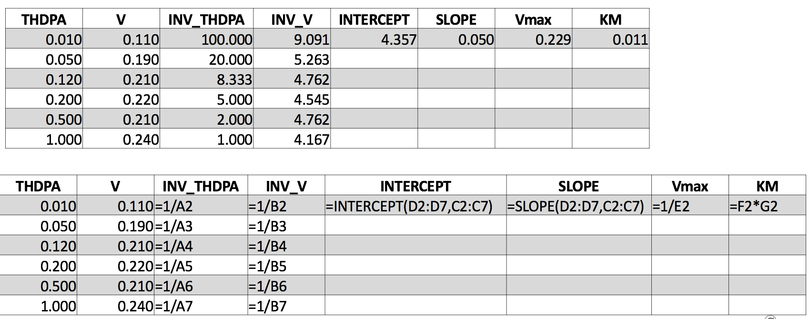

:author: Alicia Clark
:email: clarka34@uw.edu
:institution: University of Washington

:author: Joseph Hellerstein
:email: joseph.hellerstein@gmail.com
:institution: University of Washington
:corresponding:

--------------------------------------------------------------------------------------------------------------------
SciSheets: Delivering the Power of Programming With The Simplicity of Spreadsheets
--------------------------------------------------------------------------------------------------------------------

.. class:: abstract

Short abstract.

.. class:: keywords

   software engineering

1. Introduction
---------------

Digital spreadsheets are the "killer app" that ushered in the PC revolution.
This is largely because spreadsheets provide a conceptually simple way to do calculations that avoids the mental burdens of programming,
especially considerations of control flow, data dependencies, and data structures.
Recent estimates suggest that over 800M professionals author spreadsheet formulas as part of their work
[MODE2017],
which is about 50 times the number
of software developers world wide [Thib2013].

Our experience is that there are three types of spreadsheet users.

 - **Calcers** want to evaluate equations.
   Spreadsheet formulas work well for Calcers since: (a) they can
   ignore data dependencies;
   (b) they can avoid flow control by using
   "copy" and "paste" for iteration; 
   and (c) data structures are "visual" (e.g., rectangular blocks).
 - **Scripters** feel comfortable with expressing calculations algorithmically using for-loops and if-then
   statements, and they can use simple data structures such as lists and dataframes (which are like spreadsheets).
   However, they rarely encapsulate code into functions, preferring to copy code to get reuse.
 - **Programmers** know about advanced data structures, modularization, and testing. 

We find that the bulk of spreadsheet users who employ formulas are Calcers and then Scripters. 
Programmers are more likely to use a mix of formulas and macros (e.g., Visual Basic for Microsoft Excel or
AppScript in Google Sheets).

Despite their appeal, the use of spreadsheet formulas has severe shortcomings.

- poor scalability because executing formulas within the spreadsheet system has high overhead;
- great difficulty with reuse because there is no concept of encapsulation (and even different length data are problematic);
- great difficulty with transitioning from a spreadsheet to a 
  program to facilitate integration into software systems;
- limited ability to handle complex data because 
  there is no concept of structured data;
- poor readability because formulas must be expressions 
  (not scripts) and any cell may have a formula; and
- limited ability to express calculations because formulas 
  are restricted to using a few hundred or so functions 
  provided by the spreadsheet system (or specially coded macros).

Academic computer science has recognized the growing importance
of end-user programming (EUP) [BURN2009].
Even though
spreadsheets are likely the most pervasiveness example of EUP,
there is a virtual absence of academic literature about addressing
the shortcomings of spreadsheets.
Outside of academia there has been significant 
interest in innovating spreadsheets.
Google Fusion Tables [Gonz2010] uses column formulas to avoid a common source of errors,
the need to copy formulas as rows are added/deleted from a table.
The Pyspread [PySpread] project uses Python as the formula language, which increases the expressivity of formulas.
A more radical approach is taken by
the Stencila system [Stencila], which
provides a document structure that includes cells that execute formulas, including the display of of data tables;
cells may execute statements from many languages including Python and R.

Even with these innovations,
serious deficiencies remain in spreadsheets:

1. The expressivity of formulas is limited because formulas are 
   restricted to being expressions, not scripts (although 
   Stencila does provide a limited form of scripting).
2. It is almost impossible to reuse spreadsheet
   formulas, especially to allow software systems
   to reuse calculations done in spreadsheets.
3. It remains burdensome to deal
   with complex data relationships in spreadsheets, such as
   hierarchically structured data.
4. Very little has been done to address the performance problems that occur as spreadsheets scale.

This paper introduces SciSheets [SciSheets], a new spreadsheet system with the goal of delivering
the power of programming with the simplicity of spreadsheets.
Our target users are technical professionals, such as scientists and financial engineers,
who do complex calculations on structured data.
To date, our focus has been on calculations,
not features such as formatting.

SciSheets addresses the deficiencies enumerated above by introducing
several novel features.

- *Formulas can be Python scripts, not just expressions.*
  This increases the expressiveness of formulas.
- *Tables can have nested columns (columns within columns).*
  This provides a conceptually simple way to express
  complex data relationships, such as n-to-m relationships.
- *Spreadsheets can be exported as standalone Python programs.*
  This provides for sharing and reuse since the exported codes
  can be used by other SciSheets spreadsheets or by
  python programs.
  This feature also improves scalability since
  calculations can be executed without the overhead of the spreadsheet system.

Further, SciSheets seeks to improve the programming skills of its users.
It is hoped that Calcers will start using scripts, and that Scripters will gain
better insight into modularization and testing.

The remainder of the paper is organized as follows.
Section 2 presents the use cases that we consider, and
section 3 describes how SciSheets addresses these use cases.
The design of SciSheets is discussed in Section 4.
Section 5 discusses features planned for SciSheets.
Our conclusions are presented in Section 6.

2. Use Cases
------------

We present our driving use cases by giving examples of spreadsheet uses.

   Data view (top) and formulas view (bottom) for an Excel spreadsheet that calculates Michaelis-Menten Parameters. :label:`fig-excel1`

1. Michaelis-Menten calculation of enzyme activity.

   a. Background. Common processing of biochemical assays to compute key characteristics of enzymes
   b. Use cases

      a.) UC1: Writing formulas - limited expressive power of expressions and the vendor supplied spreadsheet functions
      b.) UC2: Code reuse - impossible in existing spreadsheets

.. figure:: ExcelMultiTable.png

   Student grade data from two departments in the school of engineering. :label:`fig-excel2`

2. Managing multiple tables

   a. Background. Multiple departments in the school of engineering, 
      keeping records in slightly different ways.
   b. Use cases
 
      a) UC3: View data side-by-side, but still manage as separate tables
         in terms of insert/delete

3. How SciSheets Addresses the Use Cases
----------------------------------------

.. figure:: ColumnPopup.png

   Column popup menu in a scisheet for the Michaelis-Menten calculation. :label:`fig-columnpopup`

.. figure:: SimpleFormula.png
   :scale: 50 %

   Formula for computing the inverse of the input value S. :label:`fig-simpleformula`

.. figure:: ComplexFormula.png

   Formula for computing the slope and intercept of a regression line for the Michaelis-Menten calculation. Note that One column assigns values to another column and that a script is used. label:`fig-simpleformula`

1. SciSheets UI structure

   a. Elements - sheet, tables, columns, rows, cells (Fig)
   b. Popup menus
   c. Execution model: prologue, formula evaluations, epilogue. (Dependency checking is not possible
      because users can employ "eval" statement.)

.. figure:: TableExport.png

   Menu to export a table as a standalone python program. :label:`fig-export`

2. UC1: Formulas can be scripts

.. figure:: Multitable.png

   A table with two subtables. :label:`fig-subtables`

.. figure:: PopupForHierarchicalRowInsert.png

   Menu to insert a row in one subtable. :label:`fig-subtable-insert`

.. figure:: AfterHierarchicalRowInsert.png

   Result of inserting a row in one subtable. :label:`fig-subtable-after`

3. UC2: Code re-use through export

.. figure:: ProcessFiles.png
   :scale: 50 %

   A scisheet that processes many CSV files. :label:`fig-processfiles`

.. figure:: ProcessFilesScript.png

   Column formula that is a script to process CSV files. :label:`fig-processfiles`

4. UC3: Managing multiple tables

4. SciSheets Design
-------------------

To enable a zero-install deployment and leverage the rapid pace
of UI innovation happening with web technologies, SciSheets is a client-server
application in which the front end uses HTML and Javascript;
tables are rendered using YUI DataTables ref??.
The backend handles the bulk of the computing tasks (e.g., formula evaluation).
We connect the frontend and backend using Django ref??.

.. figure:: SciSheetsCoreClasses.png
   :scale: 30 %

   SciSheets core classes. :label:`fig-coreclasses`

Fig ?? displays the relationships between core classes in the SciSheets backend.

UC1-UC3 pose several challenges.
Prominent among these are that:
(a) the user need not be aware of data dependencies between columns and
(b) column formulas may be arbitrary Python scripts.
In particular,

1. Automated detection of data dependencies is not possible since there made be code with
"eval" statements or calls to external python functions.

2. Error localization must be more sophisticated than identify the column in which
a syntax error occurred since the column formula may be a lengthy script.

We begin with (1), our inability to use automated dependency detection.
Our solution here is ...

Concern (2), localizing errors, seques into a broader discussion of how spreadsheets are executed.
This must be done in a way so that the column formulas run in a standalone program.

.. code-block:: python

   # Function definition
   def michaelis(S, V):
     from scisheets.core import api as api
     s = api.APIPlugin('michaelis.scish')
     s.initialize()
     _table = s.getTable()

Prologue

.. code-block:: python

   #
     s.controller.startBlock('Prologue')
     # Begin Prologue
     import math as mt
     import numpy as np
     from os import listdir
     from os.path import isfile, join
     import pandas as pd
     import scipy as sp
     from numpy import nan  # Must follow sympy import
     # End Prologue
     s.controller.endBlock()

.. code-block:: python
  
   # 
     # Loop initialization
     s.controller.initializeLoop()
     while not s.controller.isTerminateLoop():
       s.controller.startAnIteration()

.. code-block:: python
  
   #
       # Formula evaluation blocks
       try:
         # Column INV_S
         s.controller.startBlock('INV_S')
         INV_S = 1/S
         s.controller.endBlock()
         INV_S = s.coerceValues('INV_S', INV_S)
       except Exception as exc:
         s.controller.exceptionForBlock(exc)
        
       try:
         # Column INV_V
         s.controller.startBlock('INV_V')
         INV_V = np.round(1/V,2)
         s.controller.endBlock()
         INV_V = s.coerceValues('INV_V', INV_V)
       except Exception as exc:
         s.controller.exceptionForBlock(exc)

.. code-block:: python
    
   #
       # Close of function
       s.controller.endAnIteration()
     
     if s.controller.getException() is not None:
       raise Exception(s.controller.formatError(
           is_absolute_linenumber=True))
     
     s.controller.startBlock('Epilogue')
     # Epilogue
     s.controller.endBlock()
     
     return V_MAX,K_M

Tests

.. code-block:: python

   from scisheets.core import api as api
   from michaelis import michaelis
   import unittest
   
   #############################
   # Tests
   #############################
   # pylint: disable=W0212,C0111,R0904
   class Testmichaelis(unittest.TestCase):
   
     def setUp(self):
       from scisheets.core import api as api
       self.s = api.APIPlugin('michaelis.scish')
       self.s.initialize()
       _table = self.s.getTable()
       
     def testBasics(self):
       # Assign column values to program variables.
       S = self.s.getColumnValue('S')
       V = self.s.getColumnValue('V')
       V_MAX,K_M = michaelis(S,V)
       self.assertTrue(
           self.s.compareToColumnValues('V_MAX', V_MAX))
       self.assertTrue(
           self.s.compareToColumnValues('K_M', K_M))
   
   if __name__ == '__main__':
     unittest.main()

5. Future Work
--------------

- Realizing the full power of hierarchies - reuse with "copy" action but with different technical semantics.

- Graphics

- Github integration

  - Why version control
  - Structure of the serialization file
  - User interface for version control

6. Conclusions
--------------

.. table:: Summary of the problems in current spreadsheets 
           and SciSheets features that are a solution to
           these problems. 
           Features in italics are planned but not yet implemented. 
           :label:`fig-benefits`

   +------------------------+-----------------------------+
   |       Problem          |         Solution            |
   +========================+=============================+
   | - expressivity         | - python formulas           |
   |                        | - formula scripts           |
   +------------------------+-----------------------------+
   | - reuse                | - program export            |
   |                        | - *hierarchical tables*     |
   |                        |   *with local scopes*       |
   +------------------------+-----------------------------+
   | - complex data         | - hierarchical tables       |
   +------------------------+-----------------------------+
   | - performance          | - progam export             |
   +------------------------+-----------------------------+
   | - debuggablity of      | - localized exceptions      |
   |   scripts              |                             |
   +------------------------+-----------------------------+
   | - reproducibility      | - *github integration*      |
   +------------------------+-----------------------------+

References
----------
.. [BURN2009] Burnett, M. *What is end-user software engineering and why does
              it matter?*, Lecture Notes in Computer Science, 2009
.. [MODE2017] *MODELOFF - Financial Modeling World Championships*,
              http://www.modeloff.com/the-legend/.
.. [Thib2013] Thibodeau, Patrick. 
              *India to overtake U.S. on number of developers by 2017*, 
              COMPUTERWORLD, Jul 10, 2013.
.. [Gonz2010] *Google Fusion Tables: Web-Centered Data Management
              and Collaboration*, Hector Gonzalez et al., SIGMOD, 2010.
.. [PySpread] Manns, M. *PYSPREAD*, http://github.com/manns/pyspread.
.. [Stencila] *Stencila*, https://stenci.la/.
.. [SciSheet] *SciSheets*, https://github.com/ScienceStacks/SciSheets.
