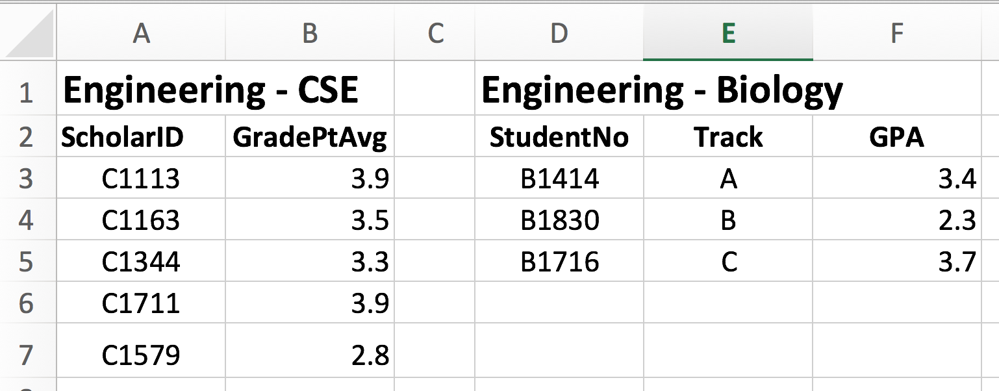
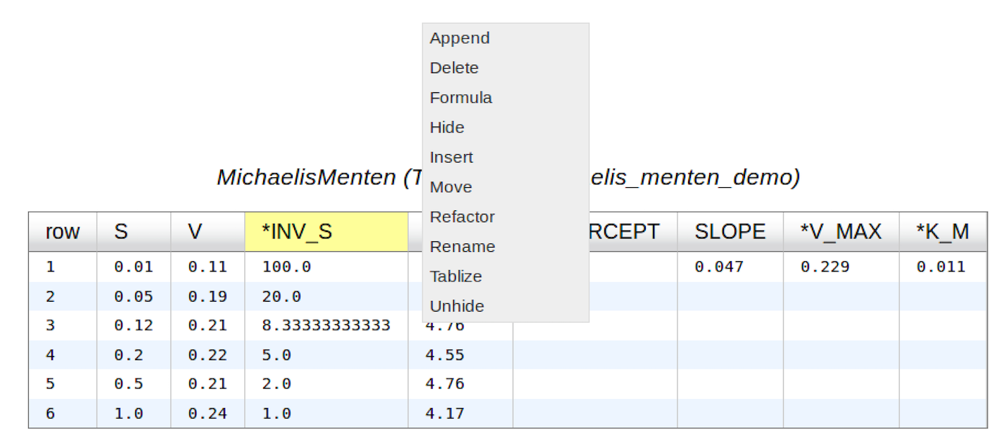
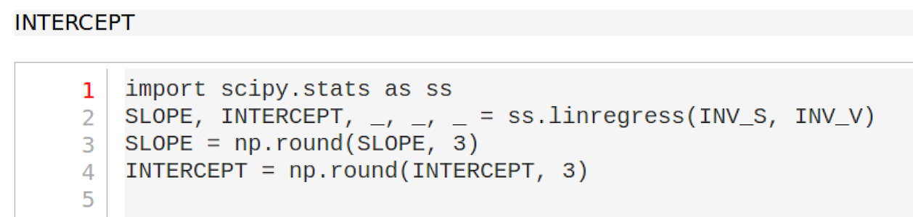
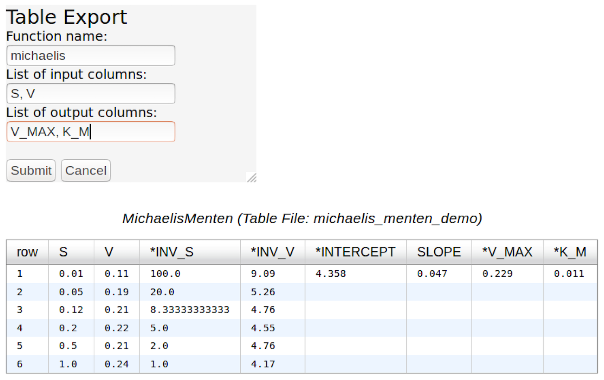
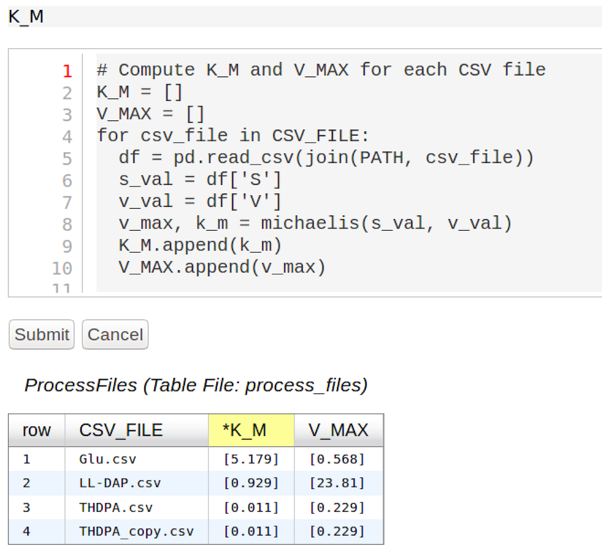
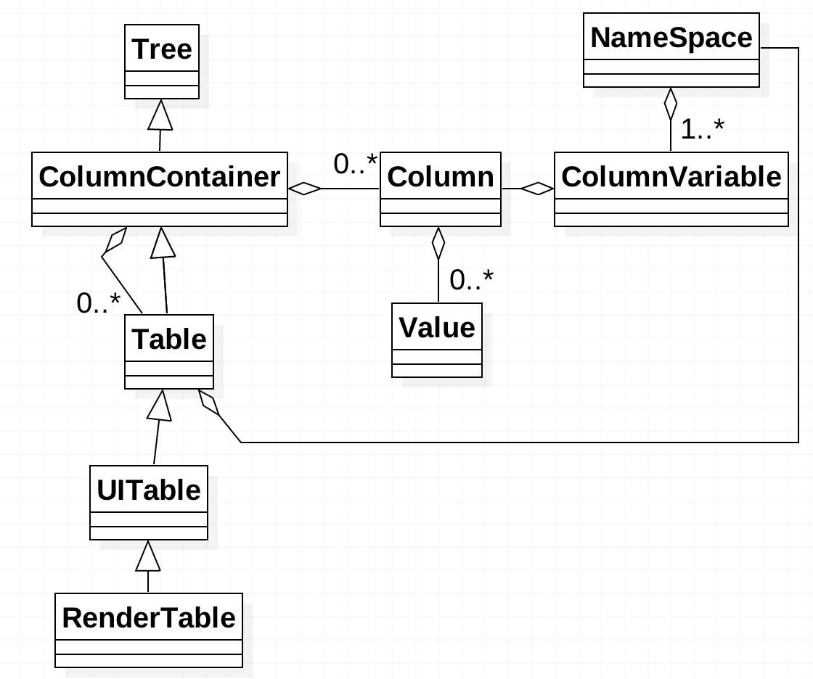

:author: Alicia Clark
:email: clarka34@uw.edu
:institution: eScience Institute, University of Washington

:author: Joseph Hellerstein
:email: joseph.hellerstein@gmail.com
:institution: Department of Mechanical Engineering, University of Washington
:corresponding:

--------------------------------------------------------------------------------------------------------------------
SciSheets: Delivering the Power of Programming With The Simplicity of Spreadsheets
--------------------------------------------------------------------------------------------------------------------

.. class:: abstract

Short abstract.

.. class:: keywords

   software engineering

1. Introduction
---------------

Digital spreadsheets are the "killer app" that ushered in the PC revolution.
This is largely because spreadsheets provide a conceptually simple way to do calculations that
(a) closely associates data with the calculations that produce the data and (b) avoids the mental burdens of programming
such as
control flow, data dependencies, and data structures.
Estimates suggest that over 800M professionals author spreadsheet formulas as part of their work
[MODE2017],
which is about 50 times the number
of software developers world wide [Thib2013].

We categorize
spreadsheet users as follows:

- **Calcers** want to evaluate equations.
  Spreadsheet formulas work well for Calcers since: (a) they can
  ignore data dependencies;
  (b) they can avoid flow control by using
  "copy" and "paste" for iteration; 
  and (c) data structures are "visual" (e.g., rectangular blocks).
- **Scripters** feel comfortable with expressing calculations algorithmically using ``for`` and ``if``
  statements; and they can use simple data structures such as lists and 
  ``pandas DataFrames`` (which are like spreadsheets).
  However, they rarely encapsulate code into functions, 
  preferring to ``copy`` and ``paste`` code to get reuse.
- **Programmers** know about sophisticated data structures, modularization, reuse, and testing. 

Our experience is primarily with scientists, especially biologists and chemists.
Most commonly, we encounter Calcers and Scripters.
Only Programmers take advantage of spreadsheet macro capabilities 
(e.g.,  Visual Basic for Microsoft Excel or
AppScript in Google Sheets).

Based on this experience, we find that despite the appeal of spreadsheets, especially to
Calcers and Scripters, existing spreadsheets lack several key requirements:

- **Expressivity**: The expressivity of formulas is limited because formulas are 
  restricted to being expressions, not scripts.
  This means that
  calculations cannot be written as algorithms,
  a key consideration for Scripters.
  It also means that Calcers cannot write a step-by-step
  recipe for how data are produced.
- **Reuse**: It is impossible to reuse spreadsheet
  formulas in other formulas or in software systems.
- **Complex Data**: It remains burdensome to deal
  with complex data relationships in spreadsheets, such as
  hierarchically structured data.
- **Performance**: Very little has been done to address the 
  performance problems that occur as spreadsheets scale.

Academic computer science has recognized the growing importance
of end-user programming (EUP) [BURN2009].
Even though
spreadsheets are arguably the most pervasiveness form of EUP,
there is a virtual absence of academic literature that
addresses
the shortcomings of spreadsheets.
Outside of academia there has been significant 
interest in innovating spreadsheets.
Google Fusion Tables [Gonz2010] 
and the "Tables" feature of Microsoft Excel ref??
use column formulas to avoid a common source of errors,
the need to copy formulas as rows are added/deleted from a table.
The Pyspread [PySpread] project uses Python as the formula language, which gives formulas access to thousands of Python packages.
A more radical approach is taken by
Stencila [Stencila],
a document system that provides ways to execute code that
updates tables (an approach that is in the same
spirit as Jupyter Notebooks
[Pere2015]).
Stencila supports a variety of languages including
JavaScript, Python, and SQL.
However, Stencila lacks features that spreadsheet users expect:
(a) closely associating data with the calculations that produce the data
and (b) avoiding considerations of data dependencies in calculations.

This paper introduces SciSheets [SciSheets], a new spreadsheet system with the 
objective of delivering
the power of programming with the simplicity of spreadsheets.
The name SciSheets is a contraction of the phrase "Scientific Spreadsheet", a nod to the users
who motivated the requirements that we address.
That said,
our target users are more broadly technical professionals
who do complex calculations on structured data.
We use the term **scisheet** to refer to a SciSheets spreadsheet.
We note in passing that our focus for scisheets is on
calculations,
not document processing features such as formatting and drawing figures.

SciSheets addresses the above requirements by introducing
several novel features.

- *Scisheet formulas can be Python scripts, not just expressions.*
  This addresses the expressivity requirement since
  calculations can be expressed as algorithms.
- *Scisheet can be exported as standalone Python programs.*
  This addresses the reuse requirement since
  exported spreadsheets
  can be reused in SciSheets formulas and/or by
  external programs (e.g., written by Programmers).
  Further, performance is improved by the export feaure
  since calculations can execute without the 
  overheads of the spreadsheet environment.
- *Tables can have nested columns (columns within columns).*
  This addresses the complex data requirement,
  such as representing n-to-m relationships.

The remainder of the paper is organized as follows.
Section 2 describes the requirements that we consider, and
section 3 details the SciSheets features that address these requirements.
The design of SciSheets is discussed in Section 4, and
section 5 discusses features planned for SciSheets.
Our conclusions are presented in Section 6.

2. Requirements
---------------

This section motivates through examples
the requirements of expressivity, reuse, and complex data.

Our first example is relates to a procedure done in biochemistry labs
studying enzyme mediated reactions.
Commonly, the Michaelis-Menten ref?? model of enzyme activity is used in which
there is a single chemical species, called the substrate, that interacts with the enzyme to produce
new chemical species (the product).
Two properties of enzymes are of much interest: the maximum reaction rate,
denoted by :math:`V_{MAX}`, and the concentration :math:`K_M` of substrate that achieves
a reaction rate equal to half of :math:`V_{MAX}`.
Laboratory data are collected for different values of the substrate concentration
:math:`S` and reaction rate :math:`V`.
Then, a calculation is done to obtain the parameters :math:`V_{MAX}` and :math:`K_M`.

Fig. :ref:`fig-excel1` shows an Excel spreadsheet displaying values of
:math::math:`V_{MAX}` and :math:`K_M` for a Michaelis-Menten calculation. 
The procedure is:

- Compute the inverse of :math:`S` and :math:`V`, the columns ``INV_S`` and ``INV_V``.
- Compute the intercept and slope of the regression of ``INV_V`` 
  on ``INV_S``, the columns ``INTERCEPT`` and ``SLOPE``.
- Calculate the columns ``V_MAX`` and ``K_M`` from ``INTERCEPT`` and ``SLOPE``.

Fig. :ref:`fig-excel2` shows the formulas that 
perform these calculations.

.. figure:: excel1.png

   Data view for an Excel spreadsheet that calculates Michaelis-Menten Parameters. :label:`fig-excel1`

.. figure:: excel2.png

   Formulas used in Fig. :ref:`fig-excel1`. :label:`fig-excel2`

1. Expressivity and Reuse

   a. Background. Common processing of biochemical assays to compute key characteristics of enzymes
   b. Requirements

      a.) *Expressivity*: limited ability specify calculations as expressions
      b.) *Reuse*: Cannot reuse (robustly) formulas in other spreadsheets or in software systems

   Student grade data from two departments in the school of engineering. :label:`fig-excel2`

2. Complex Data

   a. Background. Multiple departments in the school of engineering, 
      keeping records in slightly different ways.
   b. Requirements
 
      a) *Complex data*: Cannot easily manipulate complex data, such as nested tables. 
         Examples include of manipulations: View data side-by-side, but still manage as separate tables
         in terms of insert/delete.

3. Features
-----------

   Column popup menu in a scisheet for the Michaelis-Menten calculation. :label:`fig-columnpopup`

.. figure:: SimpleFormula.png
   :scale: 50 %

   Formula for computing the inverse of the input value S. :label:`fig-simpleformula`

   Formula for the complete calculation of :math:`V_{MAX}` and
   :math:`K_M`.
   The formula is a simple script, allowing a Calcer to see
   exactly how the data in the scisheet are produced.
   :label:`fig-complexformula`

3.1 User Interface
~~~~~~~~~~~~~~~~~~

1. Elements - sheet, tables, columns, rows, cells (Fig)
2. Row column - unique ID (name) for row
3. Common popup menus for sheet, table, column, row: insert, delete, hide/unhide, rename (for row, moves the row)
4. Cell - edit
5. Column: formula
6. Table: prologue, epilogue
7. scisheet: saveas, undo/redo, export

   Menu to export a table as a standalone python program. :label:`fig-export`

3.2 Formula Scripts
~~~~~~~~~~~~~~~~~~~

.. figure:: Multitable.png

   A table with two subtables.
   Subtables CSE and Biology can be manipulated separately,
   providing a way to express n-to-m relationships.
   :label:`fig-subtables`

.. figure:: PopupForHierarchicalRowInsert.png

   Menu to insert a row in one subtable. 
   The menu was accessed by left-clicking on the "3" cell
   in the column labelled "row" in the CSE subtable.
   :label:`fig-subtable-insert`

.. figure:: AfterHierarchicalRowInsert.png

   Result of inserting a row in one subtable. 
   Note that a row inserted in the CSE subtable without affecting
   the Biology substable.
   :label:`fig-subtable-after`

1. Column Variables. Column names are pandas array. Referred
   to as **Column Variables**.
   Means that vector operations are supported, natural for Calcer. Also, handles
   missing data.

2. Challenges with formula evaluation because of arbitrary code.

3. Workflow for table evaluation

   a. Prolog - initialize Column Variables from the table.
      If there is no exception, then control continues to formula evaluation.
      Otherwise an exception is raised.
   b. Formula evaluation loop. Evaluate each column formula until one of the following holds:

      a) All Column Variables have the same value in two successive iterations of the formula evaluation loop
         and there is no exception.
      b) A specified number of iterations has occurred.
         The number of iterations is equal to the number of formula columns.
         If there is no exception, then control continues to the Epilogue.
         Otherwise an exception is raised.

   c. Epilogue. Evaluate the Epilogue formula. If no exception occurs, update the column values.

3.3. Program Export
~~~~~~~~~~~~~~~~~~~

   A scisheet that processes many CSV files. :label:`fig-processfiles`

.. figure:: ProcessFilesScript.png

   Column formula that is a script to process CSV files. :label:`fig-processfiles`

3.4. Hierarchical Columns
~~~~~~~~~~~~~~~~~~~~~~~~~

4. Design
---------

To enable a zero-install deployment and leverage the rapid pace
of UI innovation happening with web technologies, SciSheets is a client-server
application in which the front end uses HTML and Javascript;
tables are rendered using YUI DataTables ref??.
The backend handles the bulk of the computing tasks (e.g., formula evaluation).
We connect the frontend and backend using Django ref??.

   SciSheets core classes. :label:`fig-coreclasses`

Fig :ref:`fig-coreclasses` displays the relationships between core 
classes used in the SciSheets backend.

The use casses create the following requirements:
(a) SciSheets must perform calculations without prior knowledge of data dependencies between
columns; and
(b) column formulas may be arbitrary Python scripts.
The implies that *SciSheets cannot use a static
analysis to discover data dependencies between columns* 
(as is possible in a traditional spreadsheet).
To see the issue here, note that a
formula may contain an ``eval`` statement on a string variable
whose value cannot be determined until runtime.
Another example is that a formula may 
call an external function
that changes values in columns.

A second implication follows from (b); this
relates to debuggability.
Specifically,
since a formula may be a script consisting of many lines, syntax errors
and exceptions must localize the problem to a line within the script.
We refer to this as the **Script Debuggability Requirement**.

We begin with our approach to handling data dependencies.
Our solution is ...

- Use term "formula evaluation loop"
- Calculation workflow

Concern (2), localizing errors, seques into a broader discussion of how spreadsheets are executed.
This must be done in a way so that the column formulas run in a standalone program.

.. code-block:: python

   # Function definition
   def michaelis(S, V):
     from scisheets.core import api as api
     s = api.APIPlugin('michaelis.scish')
     s.initialize()
     _table = s.getTable()

Prologue

.. code-block:: python

   #
     s.controller.startBlock('Prologue')
     # Begin Prologue
     import math as mt
     import numpy as np
     from os import listdir
     from os.path import isfile, join
     import pandas as pd
     import scipy as sp
     from numpy import nan  # Must follow sympy import
     # End Prologue
     s.controller.endBlock()

.. code-block:: python
  
   # 
     # Loop initialization
     s.controller.initializeLoop()
     while not s.controller.isTerminateLoop():
       s.controller.startAnIteration()

.. code-block:: python
  
   #
       # Formula evaluation blocks
       try:
         # Column INV_S
         s.controller.startBlock('INV_S')
         INV_S = 1/S
         s.controller.endBlock()
         INV_S = s.coerceValues('INV_S', INV_S)
       except Exception as exc:
         s.controller.exceptionForBlock(exc)
        
       try:
         # Column INV_V
         s.controller.startBlock('INV_V')
         INV_V = np.round(1/V,2)
         s.controller.endBlock()
         INV_V = s.coerceValues('INV_V', INV_V)
       except Exception as exc:
         s.controller.exceptionForBlock(exc)

.. code-block:: python
    
   #
       # Close of function
       s.controller.endAnIteration()
     
     if s.controller.getException() is not None:
       raise Exception(s.controller.formatError(
           is_absolute_linenumber=True))
     
     s.controller.startBlock('Epilogue')
     # Epilogue
     s.controller.endBlock()
     
     return V_MAX,K_M

Tests

.. code-block:: python

   from scisheets.core import api as api
   from michaelis import michaelis
   import unittest
   
   #############################
   # Tests
   #############################
   # pylint: disable=W0212,C0111,R0904
   class Testmichaelis(unittest.TestCase):
   
     def setUp(self):
       from scisheets.core import api as api
       self.s = api.APIPlugin('michaelis.scish')
       self.s.initialize()
       _table = self.s.getTable()
       
     def testBasics(self):
       # Assign column values to program variables.
       S = self.s.getColumnValue('S')
       V = self.s.getColumnValue('V')
       V_MAX,K_M = michaelis(S,V)
       self.assertTrue(
           self.s.compareToColumnValues('V_MAX', V_MAX))
       self.assertTrue(
           self.s.compareToColumnValues('K_M', K_M))
   
   if __name__ == '__main__':
     unittest.main()

Last, we consider performance.
Our experience is that
there are two common
causes of poor performance
in our current implementation of SciSheets. 
The first relates to data size since
since, at present,
SciSheets embeds data with the
HTML document that is rendered by the browser.
We expect to address this by implementing
a feaure
whereby data are downloaded on demand and
cached locally.

The second cause of poor performance is having
many iterations of the formula evaluation loop.
If there is more than one formula column, then the best case is to
evaluate each formula column twice.
The first execution produces the desired result
(which is possible
if the formula columns are in order of their data
dependencies);
the second execution confirms that the result has
converged.
Some efficiencies can be gained by using the Prologue and
Epilogue features for one-shot 
execution of high overhead operations (e.g., file I/O).
Also, we are exploring the extent to which SciSheets
can detect automatically when static dependency checking
is possible so that formula evaluation is done
only once.

Clearly, performance can be improved by reducing the number
of formula columns since this reduces the maximum number
of iterations of the formulation evaluation loop. 
SciSheets supports this strategy by permitting
formulas to be scripts.
This is a reasonable strategy for a Scripter, but
it may work poorly for a Calcer who is unaware
of data dependencies.

5. Future Directions
--------------------

- Hierarchical tables with local scopes provides another
  approach to reuse.

- Graphics

- Multiple languages

- Github integration

  - Why version control
  - Structure of the serialization file
  - User interface for version control

6. Conclusions
--------------

We developed SciSheets to address deficiencies
in existing spreadsheet systems.

1. Discuss entries in table. For now, performance is not evaluated.

2. SciSheets seeks to improve the programming skills of its users.
It is hoped that Calcers will start using scripts, 
and that Scripters will gain
better insight into modularization and testing.

.. table:: Summary of requirements
           and SciSheets features that address these requirements.
           Features in italics are planned but not yet implemented. 
           :label:`fig-benefits`

   +---------------------------+--------------------------------+
   |      Requirement          |    SciSheets Feature           |
   +===========================+================================+
   | - Expressivity            | - Python formulas              |
   |                           | - Formula scripts              |
   +---------------------------+--------------------------------+
   | - Reuse                   | - Program export               |
   |                           | - *Hierarchical tables*        |
   |                           |   *with local scopes*          |
   +---------------------------+--------------------------------+
   | - Complex Data            | - Hierarchical tables          |
   +---------------------------+--------------------------------+
   | - Performance             | - Progam export                |
   |                           | - Prologue, Epilogue           |
   |                           | - *Load data on demand*        |
   |                           | - *Conditional static*         |
   |                           |   *dependency checking*        |
   +---------------------------+--------------------------------+
   | - Plotting                | - *Embed bokeh components*     |
   +---------------------------+--------------------------------+
   | - Script Debuggablity     | - Localized exceptions         |
   +---------------------------+--------------------------------+
   | - Reproducibility         | - ``github`` *integration*     |
   +---------------------------+--------------------------------+

References
----------
.. [BURN2009] Burnett, M. *What is end-user software engineering and why does
              it matter?*, Lecture Notes in Computer Science, 2009
.. [MODE2017] *MODELOFF - Financial Modeling World Championships*,
              http://www.modeloff.com/the-legend/.
.. [Thib2013] Thibodeau, Patrick. 
              *India to overtake U.S. on number of developers by 2017*, 
              COMPUTERWORLD, Jul 10, 2013.
.. [Gonz2010] *Google Fusion Tables: Web-Centered Data Management
              and Collaboration*, Hector Gonzalez et al., SIGMOD, 2010.
.. [PySpread] Manns, M. *PYSPREAD*, http://github.com/manns/pyspread.
.. [Stencila] *Stencila*, https://stenci.la/.
.. [Pere2015] Perez, Fernando and Branger, Brian.
              *Project Jupyter: Computational Narratives as the
              Engine of Collaborative Data Science*, http://archive.ipython.org/JupyterGrantNarrative-2015.pdf.
.. [SciSheet] *SciSheets*, https://github.com/ScienceStacks/SciSheets.
