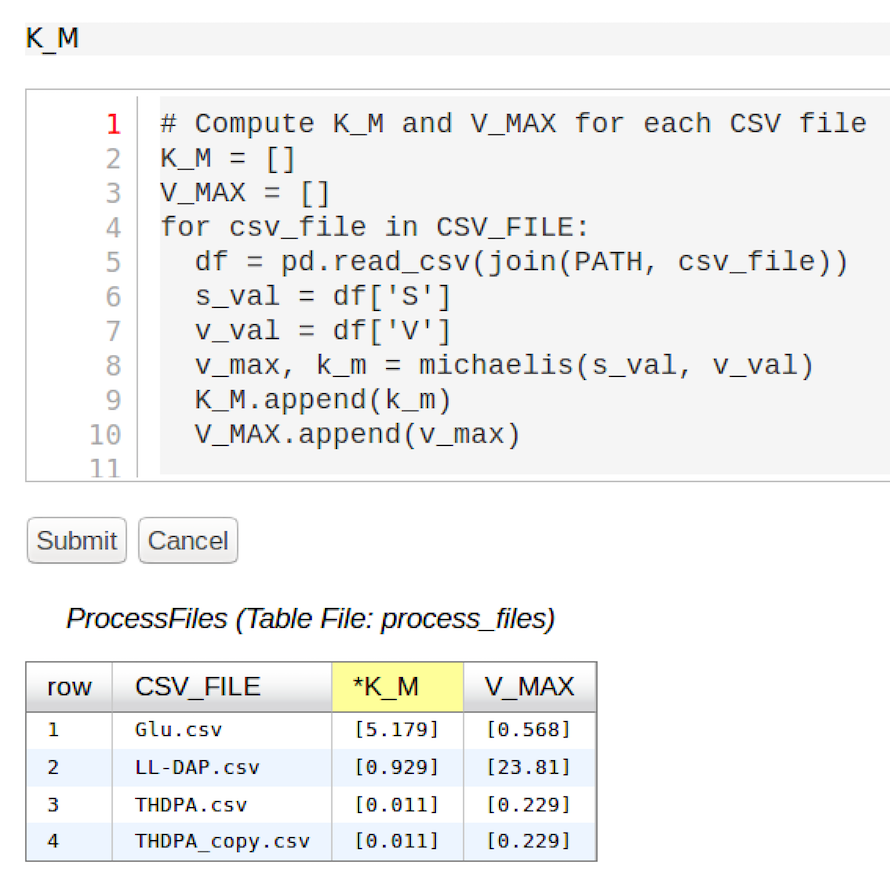

:author: Alicia Clark
:email: clarka34@uw.edu
:institution: University of Washington

:author: Joseph Hellerstein
:email: joseph.hellerstein@gmail.com
:institution: University of Washington
:corresponding:

--------------------------------------------------------------------------------------------------------------------
SciSheets: Delivering the Power of Programming With The Simplicity of Spreadsheets
--------------------------------------------------------------------------------------------------------------------

.. class:: abstract

Short abstract.

.. class:: keywords

   software engineering

1. Introduction
---------------

Digital spreadsheets are the "killer app" that ushered in the PC revolution.
This is largely because spreadsheets provide a conceptually simple way to do calculations that avoids the mental burdens of programming,
especially considerations of control flow, data dependencies, and data structures.
Recent estimates suggest that over 800M professionals author spreadsheet formulas as part of their work
[MODE2017],
which is about 50 times the number
of software developers world wide [Thib2013].

Despite their appeal, spreadsheets have severe shortcomings.

- poor scalability because executing formulas within the spreadsheet system has high overhead;
- great difficulty with reuse because there is no concept of encapsulation (and even different length data are problematic);
- great difficulty with transitioning from a spreadsheet to a program to facilitate integration into software systems and improve scalability;
- limited ability to handle complex data because there is no concept of structured data;
- poor readability because formulas must be expressions (not scripts) and any cell may have a formula; and
- limited ability to express calculations because formulas are limited to using a few hundred or so functions provided by the spreadsheet system (or specially coded macros).

Even with the
seriousness of these shortcomings, spreadsheets
have been
largely ignored in the computer science academic literature.
However, many innovative spreadsheet systems have been introduced.
Google Fusion Tables [Gonz2010] uses column formulas to avoid a common source of errors,
the need to copy formulas as rows are added/deleted from a table.
The Pyspread [PySpread] project uses Python as the formula language, which increases the expressiveness of formulas.
A more radical approach is taken by
the Stencila system [Stencila], which
provides a document structure that includes cells that execute formulas, including the display of of data tables;
cells may execute statements from many languages including Python and R.

Sadly, even with the aforementioned innovations in spreadsheets,
serious deficiencies remain.

1. The expressiveness of formulas is limited because formulas are restricted to being expressions, not scripts (although Stencila does provide a limited form of scripting).
2. None of the innovations ease the burden of
   dealing with complex data relationships, such as n-to-m relationships.
3. None of the innovations address code sharing and reuse between
   spreadsheet users or between spreadsheet users and software engineers.
4. Very little has been done to address the performance problems that occur as spreadsheets scale.

This paper introduces SciSheets [SciSheets], a new spreadsheet system with the goal of delivering
the power of programming with the simplicity of spreadsheets.
Our target users are technical professionals, such as scientists and financial engineers,
who do complex calculations on structured data.
To date, our focus has been on calculations,
not features such as formatting.

SciSheets addresses the deficiencies enumerated above by introducing
several novel features.

- *Formulas can be Python scripts, not just expressions.*
  This increases the expressiveness of formulas.
- *Tables can have nested columns (columns within columns).*
  This provides a conceptually simple way to express
  complex data relationships, such as n-to-m relationships.
- *Spreadsheets can be exported as standalone Python programs.*
  This provides for sharing and reuse since the exported codes
  can be used by other SciSheets spreadsheets or by
  python programs.
  This feature also improves scalability since
  calculations can be executed without the overhead of the spreadsheet system.

The remainder of this paper is organized as follows.

2. Use Cases
------------

.. figure:: ExistingSpreadSheet.png

   Data view (top) and formulas view (bottom) for an Excel spreadsheet that calculates Michaelis-Menten Parameters. :label:`fig-excel1`

1. Michaelis-Menten

   a. Background. Common processing of biochemical assays to compute key characteristics of enzymes
   b. Use cases

      a) Writing formulas - script vs. expression
      b) Code reuse - None

.. figure:: ExcelMultiTable.png

   Student grade data from two departments in the school of engineering. :label:`fig-excel2`

2. Managing multiple tables

   a. Background. Multiple departments in the school of engineering, 
      keeping records in slightly different ways.
   b. Use cases
 
      a) View data side-by-side, but still manage as separate tables
         in terms of insert/delete

3. Addressing the Use Cases
---------------------------

.. figure:: SciSheetFormula.png

   Data view (top) and formulas view (bottom) for an Excel spreadsheet that calculates Michaelis-Menten Parameters. :label:`fig-formulas`

1. UI structure

   a. Elements - sheet, tables, columns, rows, cells (Fig)
   b. Popup menus
   c. Execution model: prologue, formula evaluations, epilogue. (Dependency checking is not possible
      because users can employ "eval" statement.)

.. figure:: TableExport.png

   Menu to export a table as a standalone python program. :label:`fig-export`

2. Code re-use through export

   A column formula with a script that uses a previously exported table. :label:`fig-script`

3. Formulas can be scripts

.. figure:: Multitable.png

   A table with two subtables. :label:`fig-subtables`

.. figure:: PopupForHierarchicalRowInsert.png

   Menu to insert a row in one subtable. :label:`fig-subtable-insert`

.. figure:: AfterHierarchicalRowInsert.png

   Result of inserting a row in one subtable. :label:`fig-subtable-after`

4. Managing multiple tables

4. Design
---------

1. Client-Server architecture

   a. Client (JS) - Simple UI handling 
      (popups, render table, convey user inputs via AJAX)
   b. Server (python) - table storage, formula evaluation

2. Dependencies - Django, JS packages
3. Class hierarchy
4. Table evaluation - code generation
5. Logging and performance

5. Future Work
--------------

- Realizing the full power of hierarchies

- Graphics

- Version control

6. Conclusions
--------------

References
----------
.. [MODE2017] *MODELOFF - Financial Modeling World Championships*,
              http://www.modeloff.com/the-legend/.
.. [Thib2013] Thibodeau, Patrick. 
              *India to overtake U.S. on number of developers by 2017*, 
              COMPUTERWORLD, Jul 10, 2013.
.. [Gonz2010] *Google Fusion Tables: Web-Centered Data Management
              and Collaboration*, Hector Gonzalez et al., SIGMOD, 2010.
.. [PySpread] Manns, M. *PYSPREAD*, http://github.com/manns/pyspread.
.. [Stencila] *Stencila*, https://stenci.la/.
.. [SciSheet] *SciSheets*, https://github.com/ScienceStacks/SciSheets.
